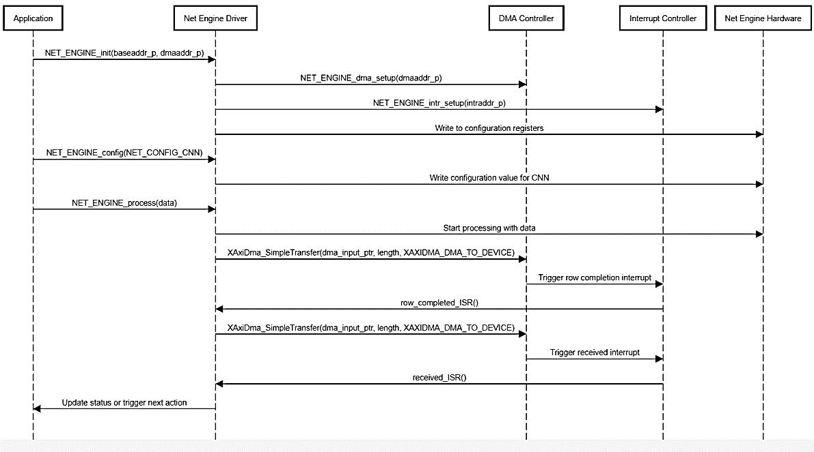

# Net Engine Driver

The **Net Engine Driver** is a critical component of the system that facilitates communication between the Processing System (PS) and the Net Engine IP implemented on the FPGA. This driver is responsible for configuring the hardware accelerator, managing data transfers, and handling interrupts to ensure efficient operation of the hardware.

## Overview

The Net Engine Driver interacts with the Net Engine IP to perform convolution and max-pooling operations. By leveraging Direct Memory Access (DMA), the driver ensures minimal latency and maximizes throughput, allowing for real-time processing in edge applications.

### Key Functions

The driver includes several key functions that perform the following operations:

- **Initialization**: Prepares the driver and the Net Engine IP for operation.
- **Configuration**: Sets up the operational parameters of the Net Engine, such as kernel sizes, bias values, and operational modes (e.g., convolution or max-pooling).
- **Data Transfer**: Manages the movement of input data to the Net Engine and retrieves output data back to the PS.
- **Interrupt Handling**: Responds to interrupts from the Net Engine to signal when processing is complete or if an error has occurred.

### Key Functions Breakdown

1. **`NET_ENGINE_init()`**
   - Initializes the Net Engine driver, setting the base addresses for the Net Engine IP and configuring DMA settings.
   - Prepares the driver for communication with the Net Engine IP.

2. **`NET_ENGINE_config()`**
   - Configures the Net Engine IP with parameters for the convolution or max-pooling operations.
   - Accepts arguments such as kernel size, stride, and padding to customize the operation.

3. **`NET_ENGINE_process()`**
   - Sends input data to the Net Engine IP for processing.
   - Initiates the convolution or max-pooling operation on the FPGA.

4. **`row_completed_ISR()`**
   - Interrupt Service Routine (ISR) that is triggered when a row of data has been processed by the Net Engine IP.
   - Handles the completion of processing and prepares for the next data row.

5. **`received_ISR()`**
   - ISR triggered when the entire frame of data has been processed.
   - Manages the retrieval of output data and signals that processing is complete.

### Data Flow

The driver employs a well-defined data flow to maximize efficiency:
1. **Input Data Preparation**: Input data is prepared and transferred to the memory accessible by the Net Engine IP.
2. **Initiate Processing**: The driver configures the Net Engine and starts the processing operation using `NET_ENGINE_process()`.
3. **DMA Transfer**: Direct Memory Access is used to handle data movement between the PS and the FPGA, ensuring high-speed transfers.
4. **Completion Notification**: The driver listens for interrupts to determine when processing is complete and retrieves the output data.

### Sequence Diagram

The following sequence diagram illustrates the interactions between the Processing System, Net Engine Driver, and Net Engine IP during the processing of input data:

  
*Figure 1: Sequence Diagram for Net Engine Driver Operations*

**Description of Sequence Steps**:
1. **Initialization**: The driver initializes the Net Engine IP.
2. **Configuration**: The driver configures operational parameters for the convolution and max-pooling operations.
3. **Data Transfer**: Input data is sent to the Net Engine IP via DMA.
4. **Processing**: The Net Engine IP processes the input data.
5. **Completion Notification**: The Net Engine sends an interrupt to the driver to signal that processing is complete.
6. **Output Retrieval**: The driver retrieves the processed output data from the Net Engine IP.

### Usage

To use the Net Engine Driver in your application, follow these steps:

1. **Include the Driver Header**: Ensure you include the driver header file in your project.
2. **Initialize the Driver**: Call `NET_ENGINE_init()` to set up the driver and hardware.
3. **Configure the Net Engine**: Use `NET_ENGINE_config()` to set the parameters for your specific convolution or max-pooling operations.
4. **Process Data**: Call `NET_ENGINE_process()` to start the processing of input data.
5. **Handle Outputs**: Implement the necessary logic to retrieve and utilize the output data once processing is complete.

## Conclusion

The Net Engine Driver is essential for integrating the FPGA-based Net Engine IP with the Processing System. By efficiently managing configuration, data transfers, and interrupts, the driver enhances the overall performance and responsiveness of the system, making it suitable for real-time applications in edge computing.

For further details on specific implementations and examples, refer to the source code in the `source files/net engine driver` directory.
