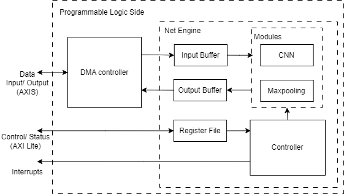
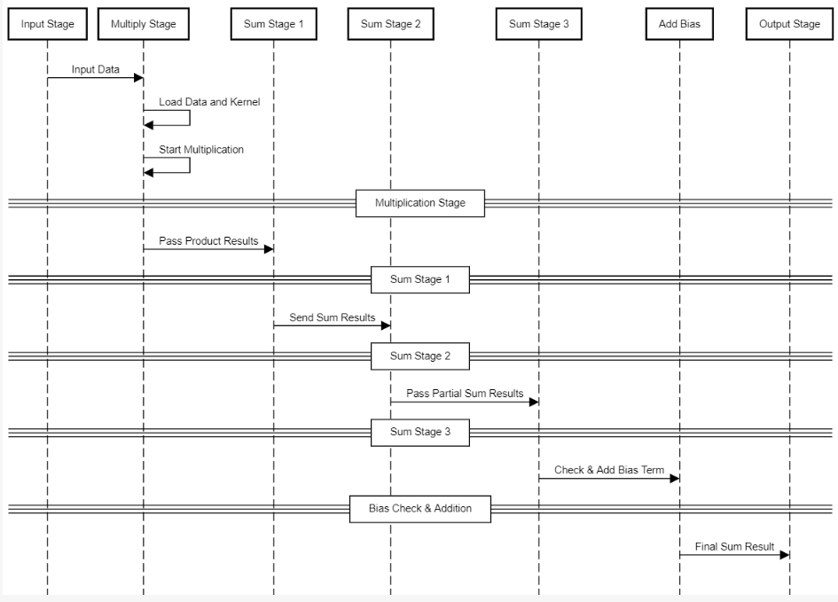
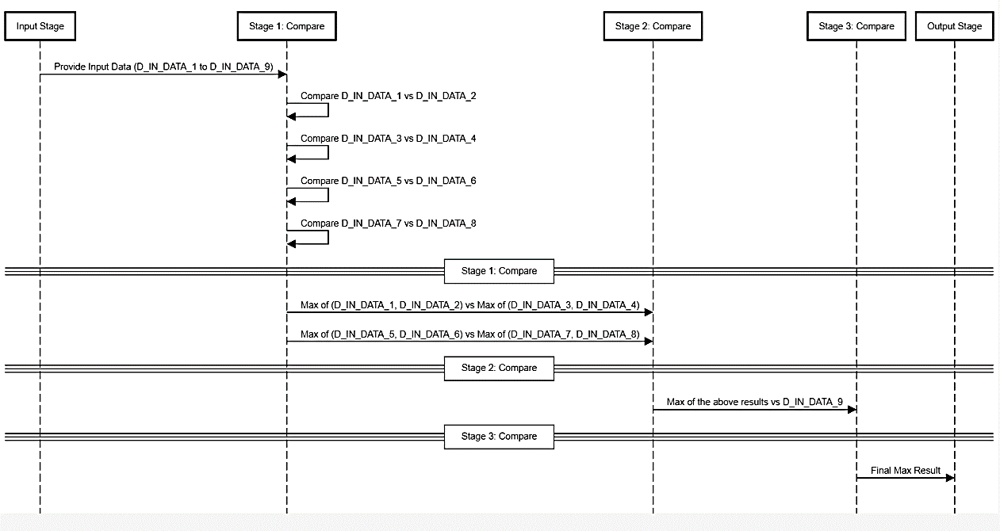

# Net Engine IP

The **Net Engine IP** is a custom hardware accelerator designed to perform convolution and max-pooling operations on an FPGA, specifically implemented on the PYNQ-Z2 development board. This document provides an overview of its architecture, functionality, and operational workflow.

## Overview

The Net Engine IP leverages the parallel processing capabilities of FPGAs to accelerate deep learning tasks, particularly in applications such as facial recognition. By offloading intensive computations from the CPU, the Net Engine improves performance, reduces latency, and enhances energy efficiency.

### Key Features

- **Configurable Registers**: The Net Engine IP allows for dynamic configuration of parameters such as kernel size, stride, and padding, enabling it to adapt to various neural network architectures.
  
- **Optimized Data Flow**: Data is transferred between the Processing System (PS) and the Net Engine IP using Direct Memory Access (DMA), minimizing bottlenecks and ensuring high throughput.

- **Low Latency**: The architecture is designed to maintain low latency during operations, making it suitable for real-time applications.

## Architecture

The architecture of the Net Engine IP consists of the following key components:

1. **Convolution Module**: Responsible for performing convolution operations on input data using configurable kernels. This module applies filters to the input feature maps to extract relevant features.

2. **Max-Pooling Module**: Reduces the spatial dimensions of the feature maps generated by the convolution module. This module retains the most significant features while minimizing the amount of data processed in subsequent layers.

3. **Control Logic**: Manages the operation of the convolution and max-pooling modules. This includes handling configuration settings and coordinating the flow of data.

4. **AXI Interfaces**: Utilizes AXI (Advanced eXtensible Interface) protocols for communication with the Processing System. This includes:
   - **AXI Lite**: Used for configuration and control of the Net Engine IP.
   - **AXI Stream**: Used for data transfer during processing.

### Block Diagram

  
*Figure 1: Net Engine IP Architecture*

## Functionality

### Operation Flow

1. **Initialization**: The Net Engine IP is initialized by the Net Engine Driver, which sets the base addresses and configures necessary registers.

2. **Configuration**: The driver configures the convolution and max-pooling operations using `NET_ENGINE_config()`, specifying parameters like kernel size, stride, and padding.

3. **Data Input**: Input data is transferred to the Net Engine IP via AXI Stream interfaces. This data can be feature maps from previous layers or raw input data.

4. **Processing**:
   - **Convolution**: The Convolution Module processes the input data according to the configured parameters, applying the specified kernels.
   - **Max-Pooling**: The resulting feature maps are passed to the Max-Pooling Module to reduce dimensions and retain important features.

5. **Output**: The processed data is sent back to the Processing System, where it can be used by subsequent layers of the neural network.

### Register File

The Net Engine IP core is configured and controlled through a series of 20 registers, categorized as follows:

- **Configuration Registers (5 Registers)**: These registers configure key operational parameters of the Net Engine IP, such as activation functions, kernel sizes, strides, and padding. By setting these parameters, the IP core can be tailored for various convolution tasks effectively.

- **Kernel and Bias Registers (10 Registers)**: These registers store the kernel weights and bias values required for convolution operations. They facilitate the precise loading of convolutional parameters into the processing units, ensuring accurate and efficient computation.

- **Status Registers (5 Registers)**: These registers provide real-time status updates, including processing progress and completion flags, which are essential for monitoring the IP core’s operations and ensuring that tasks are completed within the required timeframes.

#### Register Map

| Register Name                    | Description                                         | Offset |
|----------------------------------|-----------------------------------------------------|--------|
| **Status Registers**             |                                                     |        |
| NET_ENGINE_STATUS_REG_1          | Status information                                  | 0x00   |
| NET_ENGINE_STATUS_REG_2          | Status information                                  | 0x04   |
| NET_ENGINE_STATUS_REG_3          | Status information                                  | 0x08   |
| NET_ENGINE_STATUS_REG_4          | Status information                                  | 0x0C   |
| NET_ENGINE_STATUS_REG_5          | Status information                                  | 0x10   |
| NET_ENGINE_STATUS_REG_6          | Status information                                  | 0x14   |
| **Configuration Registers**       |                                                     |        |
| NET_ENGINE_CONFIG_REG_1          | Select convolution / max-pooling Operation         | 0x18   |
| NET_ENGINE_CONFIG_REG_2          | Input Row Length                                   | 0x1C   |
| NET_ENGINE_CONFIG_REG_3          | Net Engine Enable/Disable                          | 0x20   |
| NET_ENGINE_CONFIG_REG_4          | Reserved                                            | 0x24   |
| **Kernel and Bias Registers**     |                                                     |        |
| NET_ENGINE_BIAS_REG              | Bias values for convolution operations              | 0x28   |
| NET_ENGINE_KERNEL_REG_1           | Kernel weights for convolution operations           | 0x2C   |
| NET_ENGINE_KERNEL_REG_2           | Kernel weights for convolution operations           | 0x30   |
| NET_ENGINE_KERNEL_REG_3           | Kernel weights for convolution operations           | 0x34   |
| NET_ENGINE_KERNEL_REG_4           | Kernel weights for convolution operations           | 0x38   |
| NET_ENGINE_KERNEL_REG_5           | Kernel weights for convolution operations           | 0x3C   |
| NET_ENGINE_KERNEL_REG_6           | Kernel weights for convolution operations           | 0x40   |
| NET_ENGINE_KERNEL_REG_7           | Kernel weights for convolution operations           | 0x44   |
| NET_ENGINE_KERNEL_REG_8           | Kernel weights for convolution operations           | 0x48   |
| NET_ENGINE_KERNEL_REG

*Table 2: The Register File of the Net Engine IP*

### Performance

The Net Engine IP significantly enhances the performance of convolutional neural networks by:
- Reducing computation time through parallel processing.
- Minimizing data transfer latencies via DMA.
- Allowing for real-time data processing suitable for edge applications.

# Convolution and Max-Pooling Implementation

This document describes the implementation details of the Convolution and Max-Pooling modules in the hardware-accelerated system designed for real-time facial computing.

## 3.4.4 Convolution Module Implementation

The convolution module is designed to perform the convolution operation commonly used in Convolutional Neural Networks (CNNs). It is parameterized by data width and kernel size, allowing adaptability for various precision levels and filter sizes. In this implementation, the module is configured with a 32-bit data width and a 3x3 kernel size, suitable for high-precision computations typically required in deep learning applications.

### Operation Overview

The convolution module processes input data through five stages: multiplication, summation, bias addition, and output validation. It handles cases where the bias is zero efficiently.

  
*Figure 6: Convolutional Pipeline Sequence Diagram*

### Breakdown of Stages

1. **Net Engine Configuration for Convolution**:
   - **Data Inputs**: The module accepts 9 input data values, each representing a pixel or feature from the input channel.
   - **Kernel Inputs**: It receives 9 kernel weights, which are used to perform the convolution operation with a 3x3 matrix.
   - **Bias Input**: A bias value is used at the final computing stage.

2. **Multiplication Stage**:
   - **Component**: Utilizes `float32_multiply` modules.
   - **Function**: Each input data value is multiplied by its corresponding kernel weight through 9 separate multiplication operations.
   - **Outputs**: The multiplication results are stored in internal registers.

3. **Summation Stage**:
   - **Component**: Utilizes `float32_add` modules.
   - **Function**: The results of the multiplications are summed to produce intermediate values:
     - **Stage 1**: The first 8 multiplication results are grouped and summed in pairs, yielding 5 intermediate sums.
     - **Stage 2**: Results from Stage 1 are summed in pairs to produce 3 intermediate sums.
     - **Stage 3**: The results from Stage 2 are summed to produce a final sum.

4. **Bias Addition**:
   - **Component**: Uses the `float32_add` module for bias addition.
   - **Function**: The final sum from Stage 3 has the bias value added. If the bias value is zero, it is skipped to improve efficiency.
   - **Handling**: Logic is included to conditionally add the bias only if it is non-zero.

5. **Output Stage**:
   - **Final Output**: The result after bias addition is assigned to the output register.
   - **Output Valid Signal**: A flag indicates when the output data is ready for use.

6. **Control Signals**:
   - **Data Valid Flags**: Various control signals manage the validity of data at different processing stages, ensuring correct sequential operations.

## 3.4.5 Max-Pooling Implementation

The max-pooling cell is designed to perform comparisons to determine the maximum value from a 3x3 grid of input data. The operation is divided into three stages, progressively reducing the number of values compared until a single maximum value is obtained, which is then outputted.

  
*Figure 7: Max-Pooling Cell Pipeline Sequence Diagram*

### Breakdown of Stages

1. **Input Stage**:
   - **Provide Input Data**: The initial stage involves feeding 9 values (D_IN_DATA_1 to D_IN_DATA_9) into the pipeline for processing.

2. **Stage 1: Compare**:
   - **Comparisons**:
     - Compare D_IN_DATA_1 vs D_IN_DATA_2
     - Compare D_IN_DATA_3 vs D_IN_DATA_4
     - Compare D_IN_DATA_5 vs D_IN_DATA_6
     - Compare D_IN_DATA_7 vs D_IN_DATA_8
   - **Intermediate Values**:
     - max_1_2: Max of D_IN_DATA_1 and D_IN_DATA_2
     - max_3_4: Max of D_IN_DATA_3 and D_IN_DATA_4
     - max_5_6: Max of D_IN_DATA_5 and D_IN_DATA_6
     - max_7_8: Max of D_IN_DATA_7 and D_IN_DATA_8

3. **Stage 2: Compare**:
   - **Comparisons**:
     - Max of (D_IN_DATA_1, D_IN_DATA_2) vs Max of (D_IN_DATA_3, D_IN_DATA_4)
     - Max of (D_IN_DATA_5, D_IN_DATA_6) vs Max of (D_IN_DATA_7, D_IN_DATA_8)
   - **Reduced Values**:
     - max_1_2_3_4: Max of max_1_2 and max_3_4
     - max_5_6_7_8: Max of max_5_6 and max_7_8

4. **Stage 3: Compare**:
   - **Final Comparison**:
     - Max of max_1_2_3_4 vs D_IN_DATA_9
   - **Result**: The final maximum value after comparing max_1_2_3_4, max_5_6_7_8, and D_IN_DATA_9 is produced as max_pool.

5. **Output Stage**:
   - **Final Max Result**: The output stage provides the final result of the max-pooling operation as C_OUT_DATA.

### Conclusion

The Convolution and Max-Pooling modules are implemented to operate efficiently within a pipelined architecture, enabling real-time processing for deep learning applications. Their design not only facilitates high-speed computations but also ensures flexibility for various precision and filter sizes, making them suitable for a range of AI applications.

## Conclusion

The Net Engine IP is a vital component of the hardware-accelerated solution for real-time facial computing. By providing efficient convolution and max-pooling operations on an FPGA, it allows for high-performance and low-latency processing, making it suitable for various AI applications.

For implementation details, refer to the HDL source code in the `source files/net engine ip` directory.
