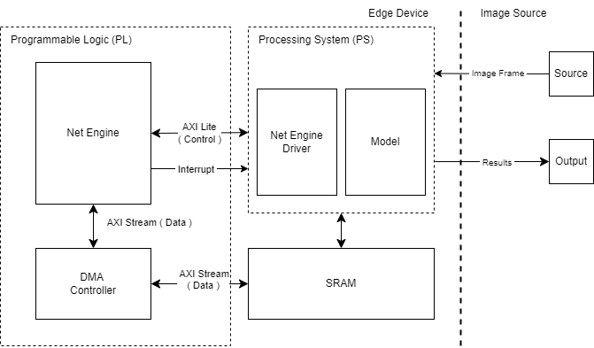

# System Overview

This project focuses on the design and implementation of a hardware-accelerated solution for real-time facial computing on embedded devices. The entire system is implemented and evaluated on a **PYNQ-Z2** development board, which features both a Processing System (PS) and Programmable Logic (PL) to enhance overall performance and efficiency.

## Architecture

The central design on the PL side is known as the **Net Engine IP**, which is responsible for performing Convolution and Max-pooling operations. This design includes configurable registers that allow for flexibility in operations. 

The data and control flows are optimized through the use of **Direct Memory Access (DMA)** and interrupt mechanisms, ensuring minimal latency and high throughput while maintaining system accuracy.

### Key Features

- **High Performance**: The architecture is designed to achieve a balance between high performance, low latency, and energy efficiency respect to the pure software implementation.

- **Integration of Components**: The system design integrates several critical components to facilitate efficient data processing and communication between the PL and PS sides:
  - **Net Engine IP**: Executes Convolution and Max-pooling tasks.
  - **Processing System (PS)**: Configures and reads the status of the Net Engine IP, as well as manages DMA transfers.
  - **Net Engine Driver**: Introduced to the PS side for streamlined communication with the Net Engine IP.
  - **SRAM**: Utilized for temporary data storage, which reduces memory access times and contributes to overall system performance.

### Diagram

  

Figure : High-Level System Design

As depicted in the diagram, the architecture supports real-time facial computing and is adaptable for other computing applications that require Convolution and Max-pooling operations. This versatility offers a scalable solution for embedded systems, enabling efficient predictions and outputs.

## Conclusion

The proposed system architecture demonstrates an effective integration of hardware and software components, delivering a powerful solution for real-time facial computing on edge devices. Its design allows for easy adaptation to various applications, making it a valuable asset for developers and researchers in the

[Back to Home](./../)
